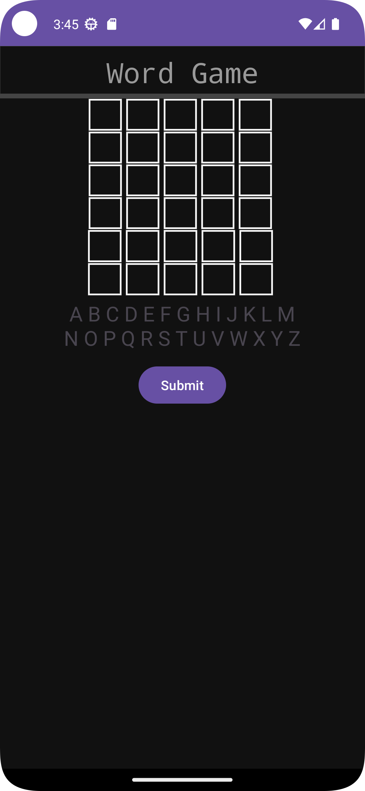
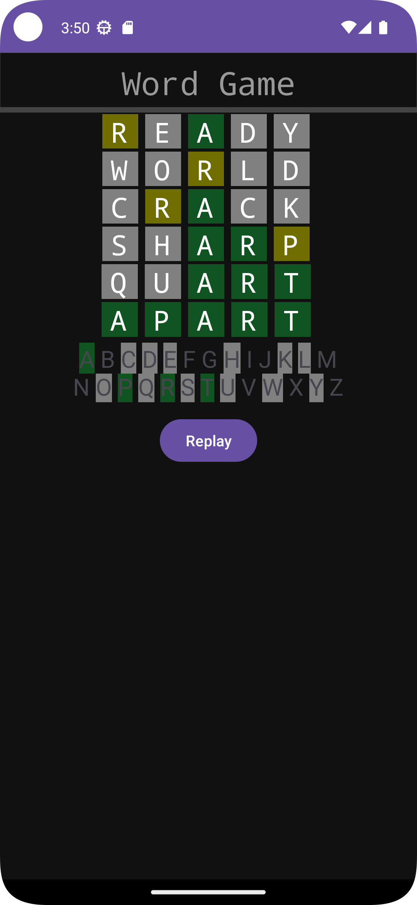

# README

## WORD GAME: A SIMPLE WORDLE CLONE
* Words are retrieved from a .txt file Resource.
* Custom EditText for entering word consist of only letter in english alphabet and displaying background colors for game logic.
* TextView with Spannable who uses BackgroundColorSpan.

