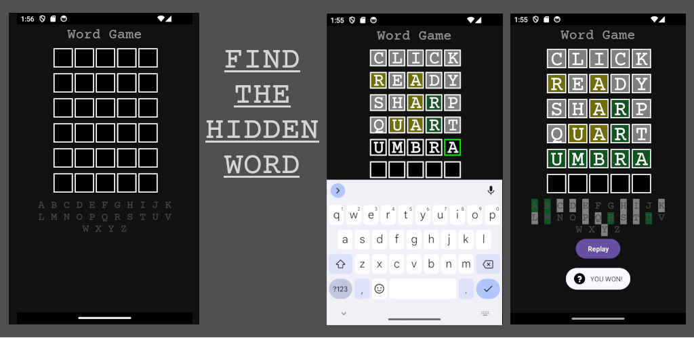

# README

## Word Game: Wordle Clone for Android (Java)

* Words are retrieved from a raw .txt file resource.
* Custom EditText for entering words consisting of only letters in the English alphabet and displaying background colors for game logic.
* Animation in Custom EditText with ValueAnimator.
* TextView with Spannable that uses BackgroundColorSpan.
* Adapting UI depending on Soft Keyboard status programmatically.

